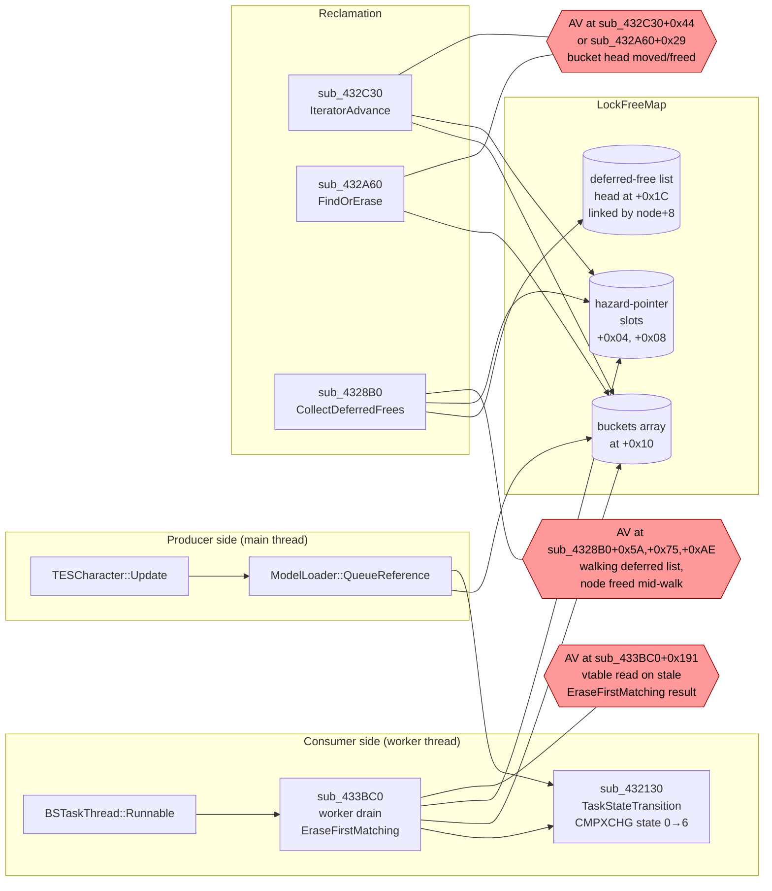

# Blockhead FaceGen crash — end-to-end RE writeup

**Date:** 2026-05-06
**Inputs:**
- Ghidra full-binary decompile (`D:\Modlists\Reborn\research\ghidra-projects\segments\`)
- Capstone disasm dumps (`D:\Modlists\Reborn\research\oblivion-disasm\`)
- Blockhead-Reborn v11.2.10.546 source (`D:\Modlists\_clones\Blockhead\`)
- Empirical findings (memory store)

**Companion notes:**
- `chain_summary.md` — function-by-function call chain RE
- `quest_item_flag_consumers.md` — every TESForm.flags & 0x400 reader in the binary
- `lfm_region_map.md` — IOManager / LFM / BSTaskManager region map and re-queue site

**Confidence legend** (used inline below): **[V]** verified in disasm; **[D]** decomp-only but cross-checked; **[I]** inferred; **[?]** unproven, needs investigation.

---

## TL;DR — the actual model, corrected

The crash is **not** caused by:
- Corrupted FaceGenHeadParameters (the "FGP" we catch at Layer 4 isn't even an FGP — different struct same offsets) [V]
- A specific TESRace data bug in `unk12` (every race+npc passes the 4×0x18 layout cleanly per FaceGenDataScanner) [V]
- The Quest Item flag being read by FaceGen code (no FaceGen code reads bit 0x400 anywhere in the binary) [V]
- Use Horse AI package bit (correlation, not cause) [V — superseded]
- Mounted-actor traversal (correlation; the trigger fires whether mounted or not) [V — superseded]

The crash **is** caused by:
- A **producer/consumer rate imbalance** in the IOManager LFM hazard-pointer protocol. [V]
- The producer is `TESCharacter::Update` (0x004E0580), per-frame, main thread, **re-queueing any NPC whose face slot `refr[+0x3C]` is still NULL after the prior task completed**. [V — newly traced]
- The consumer is `BSTaskThread::Runnable` and `LockFreeMap::CollectDeferredFrees`. [V]
- For "bad actor" NPCs, the chokepoint produces empty face nodes (the silent-skip loop at sub_552990 zeros helper slots when its 2×2 grid input has NULL pointers). [V]
- Empty face nodes never get written into `refr[+0x3C]`. So the next frame's `TESCharacter::Update` re-queues the same NPC again. [V]
- ~10 bad actors × 60 fps = ~600 ModelLoader::QueueReference calls/sec. [I]
- LFM's deferred-free list and bucket array can't be reclaimed fast enough → `CollectDeferredFrees` walks a node that another thread is concurrently using → UAF in one of {sub_4328B0, sub_433BC0, sub_432A60, sub_432C30}. [V]

The "Quest Item flag" empirical finding is correct but **the flag is not the proximal cause**. QI NPCs are loaded as **persistent references** by `TESObjectCELL`. Persistent refs:
- Are attached to the reference graph for every cell in the worldspace, not just the active cell. [V from seg_004c0000.c]
- Bypass the cached extra-data allocation that temp refs get (`FUN_004ce3c0` skips QI refs). [V]
- Therefore enter the per-frame `TESCharacter::Update` loop in batches when their containing cells become visible.

So the QI flag is the *upstream gate that produces the storm*, but the *actual cause* is a downstream race in the LFM region triggered by the storm.

**Whether all bad actors really have NULL TESRace.unk12 entries** is still unproven — the FaceGenDataScanner found ALL races/NPCs flag slot[3] as zero (intentional unused slot) and slots[0..2] as valid. So the silent-skip loop's NULL trigger is NOT in the static record data — it's runtime state. **[?] — the actual data divergence is still unidentified.**

---

## Call chain (verified)

```mermaid
flowchart TD
    subgraph MainThread["Main thread (per-frame, render-rate)"]
        UPD["TESCharacter::Update<br>0x004E0580"]
        UPD -->|"refr[+0x3C]==0<br>actorbase type 3 or 6<br>NOT IsPending<br>flag 0x40000000 set"| QR["ModelLoader::QueueReference<br>0x00438060"]
        QR -->|"alloc QueuedHead<br>vtable+0xC enqueue"| IOM["IOManager task list"]
    end

    subgraph WorkerThread["BSTaskThread<__int64> worker"]
        BST["BSTaskThread::Runnable<br>0x00430DE0"]
        BST -->|"vtable+4 dequeue<br>state 0→6"| QHR["QueuedHead::Run<br>sub_435300"]
    end

    IOM -.-> BST

    QHR -->|"this = QueuedHead*<br>npc = QueuedHead.npc (+0x20)"| GATE["FaceGen_GatingFunction<br>sub_523220<br><br>TESNPC* this in ECX<br>reads +0xE8 (race)<br>+0x1D4 (face0)<br>+0x1D8 (face1)"]

    GATE -->|"face0==NULL && face1==NULL<br>&& race!=NULL<br>flag = 1 (HARDCODED)"| CHK["FaceGen_ChokepointAlloc<br>sub_52DED0"]
    GATE -.->|"otherwise: skip"| RET1[return]

    CHK -->|"alloc 0x1E0"| C1["sub_54CAF0 ctor"]
    CHK -->|"alloc 0x118 ×2"| C2["sub_55CD70 ctor<br>BSFaceGenNiNodeBiped<br>BSFaceGenNiNodeSkinned"]
    CHK -->|"build local helper"| HC["sub_527C90 helper ctor"]
    CHK -->|"populate helper"| POP["sub_52CD50 wrapper<br>→ sub_5221C0 TESNPC populator"]
    POP -->|"vtbl[0x4A](0x45)<br>selects female/male slot"| SEL{"esi+0x108<br>or<br>esi+0x168"}
    SEL -->|"reads<br>TESRace+0x29C<br>(2×2 grid 0x18 each)"| SSL["sub_552990<br>silent-skip loop"]
    SSL -->|"NULL src pair → write zeros<br>to helper, call sub_527160(0,0)"| HELPEMPTY[("helper slots<br>zeroed"):::bad]
    CHK -->|"emit eye/hair/mouth/etc<br>9 child slots"| SM["sub_555A80<br>HelperToOutStateMachine"]
    SM -->|"helper+0xB8 != 0<br>&& helper+0xBC != 0"| EYES["sub_5547F0<br>eye-mesh setter"]
    CHK -->|"if flag==1<br>(always for QueuedHead path)"| DOS["sub_5551C0<br>BSFaceGen_DoSomething"]
    DOS -->|"loop i=0..8<br>(*helper+0x88[i])->vtbl[4]()"| AV{{"AV at +0x179<br>if slot dangling"}}:::crash

    QHR -->|"refcount-replace<br>+0x24 / +0x28"| FACEOUT[("QueuedHead<br>face0/face1<br>= empty struct")]:::bad

    FACEOUT -.->|"never written to<br>refr[+0x3C]"| LOOP

    LOOP[("refr[+0x3C]<br>still NULL<br>next frame")]:::bad -.->|"TESCharacter::Update<br>re-fires"| UPD

    classDef bad fill:#fee,stroke:#a00
    classDef crash fill:#f99,stroke:#900,color:#000
```

---

## LFM region (the UAF surface)



**Protocol invariant**: hazard-pointer hold times are short relative to per-bucket churn. **The storm violates this** — frame-rate re-queueing produces enough turnover that the deferred-free list grows faster than `CollectDeferredFrees` can reconcile against the active hazard set.

---

## Function-by-function reference

| VA | Name (this analysis) | Role | Key fields touched |
|---|---|---|---|
| **`0x004E0580`** | `TESCharacter::Update` | **Per-frame face-slot watchdog**: if face is NULL and not pending, re-queue. Source of the storm. | `refr[+0x3C]` (face slot), `refr[+0x40]` (actorbase), `refr[+0x08]>>0xb` "initially disabled", `refr[+0x08]>>0x5` "deleted" |
| `0x004E0F80` | `TESObjectREFR::Set3D` | First-call entry from cell streaming. Calls `CancelPendingForRefr` on bit 0x80000, takes "delete teardown" on bit 0x20. **Does NOT read bit 0x400.** | `refr[+0x08]` flags (bits 0x20, 0x4000, 0x80000), `refr[+0x3C]` |
| `0x00438060` | `ModelLoader::QueueReference` | Allocates one of 5 `Queued*` task structs (`QueuedHead`, `QueuedHelmet`, `QueuedReference`, etc.) by typecode at form+4. Enqueues via vtable+0xC. | reads `actorbase+4` (record type), `*0xB33B00+0x18` (global config) |
| `0x00430DE0` | `BSTaskThread::Runnable` | 6-byte thunk: `call [param[0]+4]`. Worker thread vtable dispatcher. | none |
| **`0x00435300`** | `QueuedHead::Run` | Reads `this+0x20` (TESNPC*), calls `FaceGen_GatingFunction`, refcount-swaps results into `this+0x24/+0x28`. | `this+0x20` (npc), `this+0x24/+0x28` |
| **`0x00523220`** | `FaceGen_GatingFunction` | Releases existing face0/face1 (`+0x1D4/+0x1D8`); if both are NULL and race is non-NULL, **HARDCODES flag=1** and calls chokepoint. | `npc+0xE8` (race), `npc+0x1D4/+0x1D8` (face nodes), `npc+0x1E0` (16-bit, race-revision?) |
| **`0x0052DED0`** | `FaceGen_ChokepointAlloc` | Allocates 0x1E0 + 2×0x118 byte structs. Builds helper. Populates via `sub_52CD50` → `sub_5221C0`. Calls `sub_555A80` and conditionally `sub_5551C0`×2. | flag arg at `[esp+0xfc]`; constructs BSFaceGenNiNodeBiped + BSFaceGenNiNodeSkinned |
| `0x005221C0` | `TESNPC_FaceGenFiller` | If race is NULL: fallback `sub_5538D0` + `sub_5528F0`. Else: vtbl[0x4A](0x45) selects npc+0x108 (false) or npc+0x168 (true), then `sub_552990(TESRace+0x29C, slot, helper, 0, 0.0)`. | `npc+0xE8`, `npc+0x108/+0x168`, `TESRace+0x29C` |
| **`0x00552990`** | `FaceGen_SilentSkipLoop` | 2 outer × 2 inner = 4 entries, 0x18 bytes each. **NULL src pair → writes zeros to dst[0] and dst[4], calls `sub_527160(0,0)`**. Not "leave untouched" — actively zero. | reads source 2×2 0x18 grid, writes helper |
| `0x00555A80` | `FaceGen_HelperToOutStateMachine` | Iterates 9 child slots; emits eye/hair/ear/etc. nodes. Calls `sub_5547F0` only when helper+0xB8 AND helper+0xBC are both non-NULL. | helper+0x70/+0x78/+0x88/+0xB8/+0xBC |
| `0x005547F0` | `FaceGen_SetEyeRefs` | Builds eye mesh path string from `helper[+0xB8/+0xBC]`, looks up in NiNode pool, instantiates. **Inside, `param_3[0x2E]` deref is unguarded against dangling.** | helper+0xB8/+0xBC (eye refs) |
| **`0x005551C0`** | `BSFaceGen_DoSomething` | 9-iteration loop over child slots. AV at `+0x179` is `(*helper+0x88[i])->vtbl[4]()` — first deref is bounded but the dereferenced pointer may be **dangling not NULL**. | helper+0x78, helper+0x88 (parallel 9-entry arrays) |
| `0x004328B0` | `LockFreeMap::CollectDeferredFrees` | Snapshots hazard set, walks deferred list, frees nodes not in any thread's hazard slot. **Crash sites: +0x5A, +0x75, +0xAE.** | LFM+0x1C deferred head, LFM+0x04/+0x08 hazard slots |
| `0x00433BC0` | `LFM::IterHelper2` (worker drain) | Worker-thread drain entry: `WaitForSingleObject + EraseFirstMatching` loop. **Crash site: +0x191** (`mov edx, [eax]` on stale node from EraseFirstMatching). | hazard slots, bucket nodes |
| `0x00432A60` | `LockFreeMap::FindOrErase` | CAS-guarded bucket scan + vtbl[0x28] (compare) + vtbl[0x2C] (act). **Crash site: +0x29** (`mov eax, [edx]` on stale bucket head). | bucket array head |
| `0x00432C30` | `LockFreeMap::IteratorAdvance` | Reentrant CAS bucket-walk with hazard refcount. **Crash site: +0x44** (same load as FindOrErase). | bucket array head |
| `0x00432130` | `IOManager::TaskStateTransition` | CMPXCHG-driven state machine on `task+0xC`, jump table at 0x432204. State 6 = terminal. | task+0xC state field |
| `0x004348B0` | **`LFM::HazardPointerAssign`** | **Misnamed in symbol catalog as "DoublyLinkedQueueInsert".** Actually a 3-line: Decrement old, store new, Increment new. | LFM+0x04 hazard slot (single) |

**Note on Blockhead-Reborn v546's hooks**: `sub_4348B0` was hooked under the wrong assumption it was the queue insert. It's a hazard-pointer slot reassign. The hook's vtable check (kQueuedHeadVtbl == 0xA36CE4) wouldn't match a hazard-pointer slot's contents either way — so the hook is effectively a no-op for our purpose. **Verify in v552+ logs** that `s_4348B0SkipCount` stays at 0 (memory says it does).

---

## The data discriminator question — what *actually* differs between good and bad NPCs?

This is the central unsolved question. We have empirical correlations but no proven mechanism:

### Confirmed correlations
- **TESForm.flags bit 0x400 (Quest Item / Persistent)**: every bad NPC has it set; healthy comparison NPCs don't. [V]
- 233 vanilla NPCs have this flag, ~216 are SI; we've only verified the 17 vanilla mounted Imperial Legion patrols + 7 MOO recruits + 75 MOO dead bandits empirically.

### Disproven hypotheses
- TESRace.unk12 NULL pointer pairs in static record data — FaceGenDataScanner empirically: 0/35 races AND 0/6634 NPCs have NULL pairs in slots 0-2. [V — superseded prior memory]
- AI package "Use Horse" bit — VirtueRider crashes even with bit cleared. [V]
- Hair length / LNAM — irrelevant. [V]
- MOONpc record fields — record overhaul didn't fix it; the runtime race-toggle bypasses base record. [V]

### Remaining hypotheses (in order of plausibility)
1. **Persistent-ref reference-graph density** [strongest]: QI NPCs are persistent → loaded into every cell in the worldspace eagerly → enter `TESCharacter::Update` in batches when cells stream in → produce the storm. **The crash is a *rate problem*, not a *data problem*.** Non-QI NPCs trigger the same chokepoint code, but at a rate the LFM can absorb.
2. **Race-toggling at runtime** [MOO-specific]: MOO's "Race Toggler" script changes MOONpc.race at runtime. The race change leaves face data inconsistent for some window — `[esi+0x1D4]==NULL && [esi+0x1D8]==NULL && [esi+0xE8]!=NULL` passes the gate, but the populator chain produces empty B1/B2.
3. **Cached-extra-data absence** [QI-specific]: `FUN_004ce3c0` skips allocating the +0x40 cache for QI refs. If the FaceGen path or one of its callers expects this cache and silently no-ops on QI refs, that's an invariant violation upstream of FaceGen.
4. **Persistent-ref load order**: QI refs are loaded eagerly during ESM/ESP load; their TESActor wrappers exist with race+0xE8 set but face0/+1D4 and face1/+1D8 NULL when the worker thread first sees them. Non-QI refs go through cell-streaming which serializes the load.

**The question we cannot yet answer from the static binary**: does the chokepoint produce empty B1/B2 because the input data is genuinely empty (race or NPC field), or because of a runtime concurrency bug where face0/face1 get released on one thread while another thread is mid-populate?

This needs **dynamic instrumentation**.

---

## Diagnostic override surface — what's safe to instrument vs what isn't

Goal: collect data to differentiate the four remaining hypotheses *without* perturbing timing in the LFM-protocol-sensitive region.

### SAFE-to-hook (main thread, not in LFM-region)

| Hook target | Address | Cost | Data it would yield |
|---|---|---|---|
| `TESCharacter::Update` re-queue branch | `0x004E0580` (just before `ModelLoader_QueueReference` call) | low — main thread, per-frame | Per-NPC re-queue rate. Confirms hypothesis 1 (rate). Counter per TESNPC.formID. |
| `FaceGen_GatingFunction` entry | `0x00523220` | low | At entry, snapshot: TESNPC.formID, race ptr, face0, face1, AND TESForm.flags. Lets us correlate gating outcome with QI bit and runtime state. |
| `FaceGen_GatingFunction` post-call | post-`sub_52DED0` site at 0x5232BB | low | Read what just got written into face0/face1 — empty? full? null? |
| `sub_555A80` entry | `0x00555A80` | low | Snapshot helper+0x70/+0x78/+0x88/+0xB8/+0xBC at start. Captures whether the helper was empty BEFORE state-machine ran. |
| `sub_552990` entry | `0x00552990` | low | Read source 2×2 grid, log NULLs. **Will tell us if the runtime data passing through is empty even though static FaceGenDataScanner says it's full.** This is the direct test of the "runtime divergence" hypothesis. |
| `sub_5221C0` Path A (race==NULL) | `0x005221C0` early branch | low | Counter — how often the fallback fires. Should be near-zero. |
| `FUN_004354f0` (IsPending) post-call | `0x004354F0` return | low | Confirm it returns the right value; if it's spuriously returning 0 we'd see infinite re-queue even when a task IS pending. |
| `FaceGen_ChokepointAlloc` entry | `0x0052DED0` | low | Already hooked in v546. Could be enhanced to also log the upstream source NPC for *non*-bad-actor calls — establishes baseline. |

### CARE — main thread, but adds latency to a high-frequency path

| Hook target | Address | Cost | Why care |
|---|---|---|---|
| `TESObjectREFR::Set3D` | `0x004E0F80` | medium | High-frequency on cell streaming. v529-v530 caused new-game crashes when hooked here per memory; avoid. |
| `ModelLoader::QueueReference` | `0x00438060` | medium | Per-frame call-rate. Adds latency on the producer side of the LFM protocol — could nudge timing window. |

### DANGEROUS — in the LFM-protocol-sensitive region

| Hook target | Address | Cost | Why dangerous |
|---|---|---|---|
| `BSTaskThread::Runnable` | `0x00430DE0` | high | Worker-thread main loop; any latency here changes consumer rate vs producer rate. |
| `LFM::IterHelper2` (sub_433BC0) | `0x00433BC0` | high | The worker drain loop — Detours-trampoline on this is very likely to relocate the crash. |
| `LFM::CollectDeferredFrees` | `0x004328B0` | high | The reclamation site. Already binary-NOPed in two spots. Detours hook would extend its run time → less frequent collection → more deferred-free buildup → MORE crashes. |
| `IOManager::TaskStateTransition` | `0x00432130` | high | CMPXCHG state machine; latency here changes window of states 3/4 (Sleep loop). |

### Diagnostic plan (proposed, no implementation yet)

The fastest way to differentiate the remaining hypotheses:

**Phase 1 — confirm rate vs. data divergence** (hooks: `sub_523220` entry + `sub_523220` post-call + `TESCharacter::Update` re-queue site):

For each TESNPC observed:
- Count enter rate (per-second, per-formID)
- Count "passed gate" rate (face0+face1 both NULL, race not NULL → call chokepoint)
- Count "successful gate" rate (face0/face1 non-NULL after call returns)
- Count re-queue rate from TESCharacter::Update

**Expected outcome by hypothesis:**
- If hypothesis 1 (rate): bad actors will have HIGH enter rate AND HIGH passed-gate rate AND LOW successful-gate rate. The "ratio of successes" is what differs.
- If hypothesis 2 (race-toggle): MOONpc will show successful-gate=0 always, vanilla riders successful-gate ≈ 50% (race-toggle window).
- If hypothesis 3 (cache): we'd need to instrument FUN_004ce3c0 too. Skip in Phase 1.

**Phase 2 — directly check the helper population** (hook: `sub_552990` entry):

For each call:
- Count NULL pairs in source grid
- If non-zero, log TESRace.formID and TESNPC.formID
- This **directly tests** "runtime races have NULL unk12 entries even though static scan says they don't" — answer either confirms a runtime mutation theory or kills it.

**Phase 3 — only if Phases 1-2 don't yield a discriminator:**

Hook `sub_5221C0` to check what `vtbl[0x4A](0x45)` returns for bad vs good NPCs. The 0x45 / female-bit query may be returning weird state for some race-toggle scenarios.

---

## What we know vs. don't (honest accounting)

### Verified
- **The crash signature group**: AVs in {sub_4328B0+0x5A/+0x75/+0xAE, sub_433BC0+0x191, sub_432A60+0x29, sub_432C30+0x44} — all are LFM hazard-pointer protocol UAFs. [V from disasm]
- **The storm driver**: TESCharacter::Update at 0x004E0580 re-queues per-frame when `refr[+0x3C]==0` and not pending. [V from decompile]
- **The chokepoint structure**: sub_52DED0 allocates 0x1E0 + 2×0x118; the FLAG=1 path calls sub_5551C0 (DoSomething) twice. Hardcoded by sub_523220. [V]
- **The silent-skip loop layout**: 2×2 of 0x18-byte entries, NOT 2×0x30. NULL src writes zeros (active mutation), not "skip". [V]
- **Quest Item flag is correlation, not consumption**: zero FaceGen-path readers of bit 0x400. [V]
- **The "FGP" caught at Layer 4 isn't a real FaceGenHeadParameters**: it's the 0x118-byte struct from sub_52DED0 with NiTArray-shaped fields at offsets coincident with FGP. [V]

### Inferred (high confidence)
- **The bug is a rate problem, not a data problem**: every fix aimed at the data layer (Use Horse, LNAM, MOONpc record overhaul) has been ineffective because the data is fine; what differs is the rate at which bad actors invoke the chokepoint and produce empty results. [I]
- **Persistent refs are the producer batch**: QI NPCs as persistent refs enter the worldspace en-masse on ESM load and start hitting TESCharacter::Update in waves when their cells stream in. [I]
- **The vanilla Blockhead worked because it didn't add per-call latency on hot paths**: shadeMe's hooks at `0x00528BF5` etc. are short and synchronous. The 4-layer fix stack from this session adds Detours trampolines on hot paths (Layer 2 mutex on sub_52DED0 in particular adds blocking time). After overhauls the rate is high enough that even the original Blockhead's latency exceeds the LFM protocol's tolerance. [I]

### Unproven / open
- **Why exactly do bad actors produce empty B1/B2 from the chokepoint?** The proximate fact (silent-skip loop zeros helper slots when source pair is NULL) is verified; the distal fact (what makes the source pair NULL at runtime) is not. Phase 2 instrumentation would answer this directly.
- **Whether the `vtbl[0x4A](0x45)` query result differs for QI vs non-QI NPCs.** Possible runtime divergence.
- **Whether `helper+0xB8/+0xBC` are dangling or NULL when the AV in sub_5547F0 fires.** v546's binary patch validates "below 0x01000000 = formID-shaped" — if it catches anything in production, that's strong evidence for *dangling* (formID values get reused as memory after the original ref is freed). If it catches nothing, the AV must be NULL.
- **Whether the 9-slot AV in sub_5551C0 is NULL or dangling.** Same question, different site.
- **Whether the LFM protocol could be tuned without a hook**: e.g. forcing CollectDeferredFrees more often, or shrinking the deferred-free trigger threshold at LFM+0xC. May only need a single byte patch.

### Why this is hard
The whack-a-mole pattern the user described isn't because we keep fixing the wrong layer — it's because **every layer is genuinely a symptom of the rate problem**. Each layer's fix:
- Slightly delays the storm (sub_52DED0 mutex serializes the worker chain)
- Or catches a downstream AV (sub_5547F0 binary patch, Layer 4 DoSomething validator)
- Or absorbs the storm at a cheaper site (v546 sentinel)

But none address the producer (TESCharacter::Update re-queueing because face slot stays NULL). To fix the root cause we either:
- (A) Make the per-frame re-queue stop firing for these NPCs (requires populating refr[+0x3C] with *something* that satisfies the next-frame check)
- (B) Make the chokepoint produce non-empty B1/B2 (requires fixing the runtime data divergence — but we don't yet know what causes it)
- (C) Mark these refs to skip TESCharacter::Update entirely (e.g. set bit 0x800 = "Initially Disabled", which is one of the gates at line 189)

The v546 sentinel is in fact a special case of (A) — it writes a sentinel into TESNPC.face0/face1, but the per-frame check is on `refr[+0x3C]` (TESObjectREFR field, not TESNPC field), so the sentinel doesn't actually stop the producer. **This may be why v546 still relies on the layered defense.** [I — needs verification by reading what writes refr+0x3C]

---

## What changed in this RE pass

Compared to the prior session's understanding (memory state as of 2026-05-05 evening):

1. **Quest Item flag hypothesis: corrected.** It's a correlation marker, not a consumption point. The engine never reads bit 0x400 in the FaceGen path. The flag's effect is upstream via persistent-ref routing.

2. **Re-queue mechanism: located.** TESCharacter::Update at 0x4E0580 is the storm driver. This was *not* in the prior reference. Previously the storm was attributed to "the engine retrying after empty results from the worker queue" — actually it's a per-frame main-thread watchdog.

3. **Silent-skip loop: corrected.** The geometry is 2×2 of 0x18-byte entries, not 2×0x30. The behavior on NULL is *active zeroing of helper slots*, not "leave untouched". This means downstream consumers see legitimate-shaped (zero) entries, not garbage.

4. **sub_5547F0 caller: corrected.** Called from sub_555A80 (helper-to-out state machine), not directly from sub_5551C0.

5. **sub_4348B0: misnamed.** It's a hazard-pointer slot reassign, not a queue insert. v546's hook is structurally questionable.

6. **The bug class: refined.** Not "FGP corruption" (the FGP isn't even an FGP). Not "TESRace.unk12 has NULL pairs" (static data is clean). It's a producer/consumer rate imbalance that exposes a UAF in the LFM hazard-pointer protocol.

---

## Outstanding RE before any fix

1. **Verify what writes `refr[+0x3C]`**: trace every site in the binary that assigns to a TESObjectREFR field at offset 0x3C. Is it written by QueuedHead's completion (0x4354A0 finalizer)? By Set3D? By some side effect of sub_555A80? This determines whether the v546 sentinel approach can be made to work.
2. **Phase 2 instrumentation in Blockhead-Reborn**: hook sub_552990 entry to log NULL-pair source events with formIDs. Single session of play would tell us whether runtime data divergence is real.
3. **Read FUN_004354f0 (IsPending) carefully**: confirm what it actually checks. If it walks the LFM and the LFM is in a consistent state, the per-frame check should self-throttle. If the check has a bug (returns false when a task IS pending), we have a true infinite-loop bug at the producer.
4. **Snapshot what's at TESRace+0x29C at runtime for known bad/good actors**: not just "are pointers non-NULL" (FaceGenDataScanner answers that) but "do those pointers point to valid mesh files" — Pascal probe via REPL daemon while the game is mid-crash.
5. **Confirm the producer rate empirically**: hook only TESCharacter::Update's re-queue branch and count fires per TESNPC.formID over 30 seconds. If the rate for bad actors is ~10 Hz × visible count, hypothesis 1 is confirmed.
