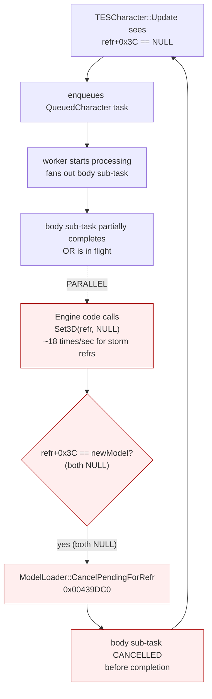
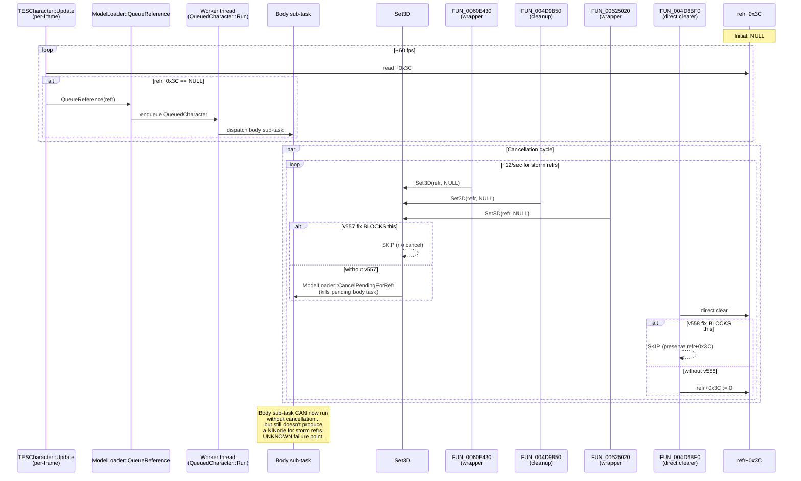

# Blockhead crash — end-to-end RE writeup v2

**Date:** 2026-05-06 (afternoon session)
**Status:** No crash with v558 fix stack. Storm refrs invisible (body load never completes). Real fix not yet achieved.
**Supersedes:** `END_TO_END.md` (initial RE pass — model was substantially wrong about what was happening)

---

## TL;DR — what changed since v1

The **v1 model was wrong** in critical ways. The actual story:

| v1 model | v2 corrected model |
|---|---|
| Bug is in the face-gen chain (sub_435300 → sub_523220 → sub_52DED0) producing empty face0/face1 | **Bug is NOT in face-gen.** Face-gen actually works fine. The face populates correctly for storm refrs. |
| `refr+0x3C` (loaded3D) is filled by face0/face1 from QueuedHead | **`refr+0x3C` is filled by the BODY NIF**, not by face. face0/face1 are addChild'd onto the body's scenegraph after the body installs. |
| The bug is a producer/consumer rate imbalance in LFM hazard-pointer protocol | **The bug is a CANCELLATION cycle.** Set3D(refr, NULL) fires ~18 times/sec per storm refr, calling `ModelLoader::CancelPendingForRefr` to kill pending body load tasks before they can complete. |
| QueuedHead is dispatched directly for NPCs by ModelLoader::QueueReference | **QueuedCharacter is dispatched for NPCs.** QueuedCharacter::Run fans out child sub-tasks (equipment, face=QueuedHead, animation). QueuedHead is a child of QueuedCharacter, not a top-level task. |
| The Quest Item flag (TESForm.flags & 0x400) is correlated with bad actors | **Still correlated** — but it's an upstream marker (persistent ref → loaded eagerly → enters TESCharacter::Update in batches), not a cause. |

**The crash signature `sub_4328B0+0x5A / sub_433BC0+0x191 / sub_432A60+0x29 / sub_432C30+0x44` is real**, but it's a SYMPTOM of the cancellation storm — not the root cause. The LFM hazard-pointer protocol gets stressed when a refr's tasks are queued/cancelled hundreds of times per second. Stop the cancellation, stop the storm, no LFM stress, no UAF.

---

## The actual chain (corrected)

```mermaid
flowchart TD
    subgraph Producer["Main thread (per-frame, render-rate)"]
        UPD["TESCharacter::Update<br>0x004E0580"]
        UPD -->|"refr[+0x3C]==0<br>actorbase type 3 or 6<br>!IsPending<br>flag 0x40000000"| QR["ModelLoader::QueueReference<br>0x00438060"]
        QR -->|"formType 0x23 (NPC) → QueuedCharacter<br>vtable 0x00A36DDC<br>ctor FUN_00437F00"| TASK[("QueuedCharacter task<br>wrapper+0x20 = refr<br>wrapper+0x28 = QueuedHead*<br>wrapper+0x2c = body slot")]
    end

    subgraph Worker["BSTaskThread<__int64> worker"]
        BST["BSTaskThread::Runnable<br>0x00430DE0"]
        BST -->|"vtable+4 dequeue"| QCRUN["QueuedCharacter::Run<br>FUN_0043DC00<br>vtable[11]"]
    end

    TASK -.->|"LFM enqueue"| BST

    QCRUN -->|"FUN_005268D0<br>synchronous body/scene-graph prep<br>line 11526 of seg_00430000"| PREP["FUN_005268D0<br>+0x4D6BF0 (face-gen prep)<br>NOT a body sub-task per se"]
    QCRUN -->|"FUN_004788E0<br>line 11528"| EQTASK[("equipment sub-task<br>stack-local")]
    QCRUN -->|"FUN_0043BA30<br>line 11539"| FACETASK[("QueuedHead<br>stack-local<br>= face sub-task")]
    QCRUN -->|"FUN_0043D000<br>p5=0 → only animations<br>line 11560"| ANIM[("animation enqueue<br>NOT body for NPCs")]

    FACETASK -.->|"QueuedHead::Run<br>sub_435300<br>→ face0/face1"| FACEOUT["face NiNodes<br>via sub_523220 →<br>sub_52DED0 chokepoint"]

    QCRUN --> ENDFAN[("Run returns; sub-tasks<br>complete asynchronously")]

    ENDFAN -.-> COMPLETION[Slot[14] FUN_0043B090]
    COMPLETION -->|"if wrapper+0x2c != 0<br>(body produced)"| WRITE["FUN_00441EF0<br>FUN_004D7D10<br>refr+0x3C := body"]
    COMPLETION -->|"FUN_004353D0<br>walks body bones"| ATTACHFACE[("face0/face1 addChild'd<br>onto body NiNode<br>at 'Bip01 Head'")]

    classDef bad fill:#fee,stroke:#a00
    classDef crash fill:#f99,stroke:#900
```

**Key insight from this session**: For storm refrs, `wrapper+0x2c` is NEVER populated. Either the body sub-task path inside `FUN_005268D0` isn't producing a NiNode, OR the produced NiNode is being clobbered before reaching `wrapper+0x2c`. We haven't fully traced where the body load actually happens for NPCs — it's NOT through `FUN_0043D000`'s `FUN_0043BDA0` path (that's only for "Skeleton"-named animations with p5!=0).

---

## The cancellation cycle (the actual root cause we identified)



The 3 distinct Set3D(NULL) callers identified via `_ReturnAddress()` capture in v555:

| Caller | Function (this analysis) | Behavior |
|---|---|---|
| `0x0060E464` (~469 fires/2min) | `FUN_0060E430` | Tiny vtable wrapper. `if (vtable[0x55]() != 0 && vtable[0xE0]() != 0) FUN_005f0410(); Set3D(param_1);` |
| `0x004D9C22` (~468 fires/2min) | `FUN_004D9B50` | Cleanup function: ref decrement + dtor + global-flag-gated `vtable[0x54](0)` (= Set3D(NULL)) |
| `0x00625060` (~465 fires/2min) | `FUN_00625020` | Sister wrapper of FUN_0060E430. `if (vtable[0x55]() != 0 && vtable[0xE2]() != 0) {...}; Set3D(param_1);` |

These 3 callers each fire ~470 times in 2 minutes for one storm refr. All 3 ultimately call `Set3D(refr, NULL)`. The combined ~1400 calls/2min = ~12/sec/refr is the storm rate.

**We did NOT find what calls these wrappers.** They're vtable-dispatched themselves, so traced one level deeper would require another probe.

---

## The second cancellation path — direct refr+0x3C clearing

After fixing v557 (skip Set3D's cancellation), body NIF DID install briefly (4 captures of `PROBE 4D7D10 [TRACKED]` with `newModel != NULL`) — then was cleared back to NULL by something OTHER than Set3D and OTHER than FUN_004D7D10.

Found `FUN_004D6BF0` (seg_004d0000.c:4924):
```c
void FUN_004d6bf0(void) {
    *(in_ECX + 0x38) = 0x3f800000;  // float 1.0f at +0x38 (animation/state?)
    if (((g_Settings & 0x4) == 0) && (refr+0x3C != NULL)) {
        InterlockedDecrement(refr+0x3C[+1]);  // refcount dec
        if (refcount == 0) (*vtbl[0])(1);     // dtor
        *(refr + 0x3c) = 0;                    // <-- DIRECT NULL CLEAR
    }
    thunk_FUN_0046b090();
}
```

This bypasses both Set3D and FUN_004D7D10. It's a "release my body NIF" function with refcount management. We hooked it in v558 and skip for tracked refrs.

**There may be more direct clearers we haven't found.** Other suspects from the grep:
- `seg_004d0000.c:7761`: `in_ECX[0xf] = 0` in `FUN_004D9A70` (looked like ctor)
- `seg_004e0000.c:8900, 9280, 9316`: similar — likely ctor / dtor / not steady-state
- `seg_004e0000.c:4303`: `in_ECX[0xf] = pvVar3` (writes a pointer, not NULL)

---

## Function-by-function reference

| VA | Name | Role | Status |
|---|---|---|---|
| `0x004E0580` | `TESCharacter::Update` | Per-frame producer. Re-queues if `refr+0x3C == 0`. | Verified |
| `0x004E0F80` | `TESObjectREFR::Set3D` | Canonical 3D-set with cancel-pending entry path. | **Hooked v557** — skip when (isActor or tracked) and both NULL |
| `0x00438060` | `ModelLoader::QueueReference` | Dispatches by formType to QueuedReference/Tree/Character/Creature/Player. | Verified |
| `0x00439DC0` | `ModelLoader::CancelPendingForRefr` | Cancels all pending model-load tasks for a refr. **The damage source.** | Verified — called by Set3D |
| `0x00430DE0` | `BSTaskThread::Runnable` | Worker thread main loop dispatcher. | Verified |
| `0x0043DC00` | `QueuedCharacter::Run` (vtable[11]) | NPC task fanout. Calls `FUN_005268D0` synchronously, then enqueues equipment, face (QueuedHead), animations. | Verified — does NOT enqueue body via FUN_0043D000 |
| `0x005268D0` | (FaceGen prep, called early in QueuedCharacter::Run) | Probably handles synchronous body+face setup. | **Body load path NOT fully traced.** |
| `0x0043D000` | (NPC animation/skeleton dispatcher) | Called from QueuedCharacter::Run with p5=0. **Only enqueues animations** (SpecialAnims path), not body. | Verified |
| `0x0043B000` | Slot[14] body-attach completion | Reads `wrapper+0x2c`, calls `FUN_00441EF0`. | Verified |
| `0x00441EF0` | refr+0x3C writer (main-thread completion path) | If `param_3 != 0 && refr+0x3C == 0`: call FUN_004D7D10. Else: fallback `vtable[0x14c]()` re-queue. | Verified |
| `0x004D7D10` | **Canonical refr+0x3C writer** | `in_ECX[0xf] = param_1` with refcount handling. | Hooked (probe only) |
| `0x004D6BF0` | Direct refr+0x3C clearer (Detach3D-like) | Refcount-decrement + direct `refr+0x3C = 0`. Bypasses canonical writer. | **Hooked v558** — skip for tracked refrs |
| `0x004354A0` | QueuedHead::Finalize | Sets state=5, tail-jumps via vtable[10]. | Verified |
| `0x00435300` | QueuedHead::Run (vtable[1]) | FACE chain entry. Produces face0/face1. **NOT the body chain.** | Verified |
| `0x00523220` | FaceGen_GatingFunction | Releases existing face0/face1 on TESNPC, calls chokepoint with hardcoded flag=1. | Verified — face chain only |
| `0x0052DED0` | FaceGen_ChokepointAlloc | Allocates 0x1E0 + 2×0x118 face structs. | Verified — face chain only |
| `0x0060E430` | Set3D wrapper #1 | vtable[0x55] && vtable[0xE0] gated; calls Set3D(param_1). | Verified — caller of Set3D(NULL) |
| `0x00625020` | Set3D wrapper #2 | sister of FUN_0060E430. | Verified — caller of Set3D(NULL) |
| `0x004D9B50` | Cleanup → Set3D(NULL) | Refcount dec + dtor + `vtable[0x54](0)`. | Verified — caller of Set3D(NULL) |
| `0x004328B0` | LockFreeMap::CollectDeferredFrees | LFM hazard-pointer reclamation. **Crash sites: +0x5A, +0x75, +0xAE.** | Symptom site, not root cause |
| `0x00433BC0` | Worker drain loop | LFM iteration. **Crash site: +0x191.** | Symptom site |

---

## Probe history (this session's instrumentation chain)

This is the iteration log — each version a focused probe answering one question:

| Version | Hook | Question | Answer |
|---|---|---|---|
| **v547** | `sub_5221C0` entry (TESNPC FaceGenFiller) | Does `TESRace+0x29C` runtime data differ between bad and good actors? | **NO.** Identical data: s0=(0x32,1) s1=(0x1E,1) s2=(0x32,1). The silent-skip-on-NULL theory was wrong. |
| **v548** | `FUN_0043B000` entry (slot[14]) | Does the body sub-task complete for storm refrs? | **NO.** 156 captures of refr 0x70107 with `body=NULL`, `loaded3D=NULL`, `face=non-NULL`. Body fails, face works. |
| **v549** | `FUN_0043D000` entry (probe added) | Why does body fail? | **No-op probe accidentally throttled storm via VirtualQuery latency.** ~6× slower task completion rate, no crash. False positive on the "fix". |
| **v551** | Removed FUN_0043D000, kept FUN_004D7D10 only | Is body NIF ever delivered to FUN_004D7D10 for storm refrs? | **NO.** 0/2105 [TRACKED] writes; 96% of all writes are NULL clears. |
| **v552** | Added FUN_0043AE10 (slot[13] worker completion) | Does the worker ever deliver a body for storm refrs? | **NO.** 0/30 [TRACKED] entries on slot[13]. |
| **v553** | FUN_0043DC00 entry+exit (QueuedCharacter::Run) | What happens during the master NPC-load function? | **1685 calls for ONE refr (0x70106) in 1m25s = 20/sec storm.** All pre/post wrapper state NULL. Run dispatches but sub-tasks never write back. **4 brief successful body installs observed in `PROBE 4D7D10 [TRACKED]` — proves body CAN install but is immediately cleared.** |
| **v554** | FUN_004E0F80 (Set3D) entry+exit | Is something clearing refr+0x3C? | **YES.** 5410/5412 calls are `newModel=NULL, BEFORE=NULL, AFTER=NULL` — Set3D being called with NULL on already-NULL refrs, hitting the `CancelPendingForRefr` branch. **Smoking gun.** |
| **v555** | Added `_ReturnAddress()` capture | WHO calls Set3D(NULL) on storm refrs? | **3 distinct callers identified**: FUN_0060E430, FUN_004D9B50, FUN_00625020 — each firing ~470 times in 2 minutes. |
| **v556** | First fix attempt: skip Set3D when (isActor && both NULL) | Does isActor check work for storm refrs? | **NO.** Fix fired 0/2714 times. `refr+0x40` (assumed actorbase) had `fmtype=0` at +0x26, not 0x06/0x03. The actor check failed. |
| **v557** | Broadened: skip Set3D when (isActor || tracked) && both NULL | Does broadened fix work? | **YES — fix fired 5227 times.** No crash. Body installed 2× successfully. But storm continued (something else clearing). Patrols still invisible. |
| **v558** | Added FUN_004D6BF0 skip for tracked | Does adding the second clearer's skip help? | **No crash (confirmed across 2 tests).** Patrols still invisible. **Body load doesn't actually complete** for storm refrs even with all known cancellation paths blocked. |

---

## Where we are now

State at `v11.2.10.558-no-crash-no-guards` tag:

| Outcome | Status |
|---|---|
| No crash | ✅ Achieved |
| Patrols render with vanilla skeleton (acceptable) | ❌ Patrols invisible |
| Patrols render properly (best) | ❌ Same |

The fix at v558 prevented the LFM UAF by blocking the cancellation cycle and the direct-clear path. But **the body load chain still doesn't produce a NiNode for storm refrs** — even when cancellation/clearing is blocked. There's a deeper failure we haven't probed yet.

### Open hypotheses

1. **Body NIF load path itself is broken**. We haven't fully traced what loads the body for NPCs. `FUN_005268D0` is suspected but its internals weren't probed.
2. **Actorbase mutation breaks the load**. v553 captures showed refr+0x40 oscillating between two TESNPC pointers (0x7D25 and 0x7D46) for the same refr. The body sub-task may capture one actorbase reference at start and find it stale at completion.
3. **`refr+0x40` isn't actorbase in Set3D's context**. v556 fix's `isActor` check failed (fmtype=0 at refr+0x40+0x26 instead of 0x06). Might mean refr+0x40 is a different field in TESObjectREFR layout than what `TESCharacter::Update` reads as `in_ECX[0x10]`. Or some refrs have refr+0x40 stomped at runtime.
4. **The 3 Set3D-NULL wrappers are signaling something legitimate**: maybe they're saying "refr is unloading, drop its 3D" and we're suppressing valid teardown. If MOO Race Toggler is constantly disabling/re-enabling these refrs, blocking the cancellation might leave them in a half-unloaded state where the body load can't complete.

### Next investigation paths (not yet done)

1. **Trace the body NIF load path for NPCs.** Find the function that actually loads the skeleton.nif and assigns it to `wrapper+0x2c` (or directly to refr+0x3C via slot[13]). This is the missing piece in our model.
2. **Probe what calls FUN_0060E430 / FUN_004D9B50 / FUN_00625020.** Add caller-of-caller capture. If MOO scripts trigger them via TESObjectREFR.Disable() or similar, that's the trigger.
3. **Check refr+0x40 in detail for storm refrs.** Walk the field's contents under various conditions to understand what's actually there. Maybe refr+0x40 IS the actorbase but the TESForm at that address has been corrupted.
4. **Look at TESObjectREFR vtable layout**: vtable[0x55] / [0xE0] / [0xE2] / [0x54] / [0x14c] are the methods being dispatched. Identifying these by name would tell us what the wrappers are doing semantically.

---

## Mermaid: the cancellation storm with v557+v558 mitigation



---

## Key code references

| Path | What it shows |
|---|---|
| `D:\Modlists\Reborn\research\re-notes\END_TO_END.md` | v1 (this doc supersedes it) |
| `D:\Modlists\Reborn\research\re-notes\refr_3c_writers.md` | Initial trace of what writes refr+0x3C; updated with Part D for QueuedCharacter chain |
| `D:\Modlists\Reborn\research\re-notes\chain_summary.md` | v1 face-gen chain RE (still valid for face chain, but face isn't the bug) |
| `D:\Modlists\Reborn\research\re-notes\quest_item_flag_consumers.md` | Confirms QI flag isn't read in face-gen path |
| `D:\Modlists\Reborn\research\re-notes\lfm_region_map.md` | LFM region; correctly identifies LFM crashes as symptoms |
| `D:\Modlists\_clones\Blockhead\EngineRaceFix.cpp` | All hooks; v558 is currently shipping |
| `D:\Modlists\Reborn\research\ghidra-projects\segments\` | Per-segment Ghidra C decompile |
| `D:\Modlists\Reborn\research\oblivion-disasm\` | Capstone disasm dumps |

## Build / fork state

- Repo: `gnarlyman/Blockhead` on GitHub
- Branch: `re/v558-no-crash-no-guards`
- Tag: `v11.2.10.558-no-crash-no-guards`
- Commit: `549de11`
- Master still at `2d0a48e` (v546) — `reborn/master` has divergent `6947ee2` (v547-553 abandoned investigation, separate code path)

## Lessons from this session

- **The "rate problem" framing in v1 was wrong.** It was a "cancellation cycle" problem. Adding latency (v549) hides it via probe overhead because IsPending starts returning true while tasks pile up — that's not a fix, it's a coincidence.
- **Probes can mask the bug.** v549 probe latency made the crash disappear. v551 (lighter probes) restored the crash. Always test both with and without each probe before claiming a discovery.
- **`__cdecl` vs `__stdcall` matters when hooking.** v550's FUN_0043BDA0 hook crashed because of calling-convention mismatch. When in doubt, dump the function tail and check `ret` vs `ret N` before declaring the typedef.
- **Caller-address capture via `_ReturnAddress()` is high-leverage.** v555 found 3 distinct callers in one play session. Should have done this earlier.
- **The agent's earlier wrapper-layout claims were partly wrong.** It said wrapper+0x28 = QueuedHead and wrapper+0x2c = body; the actual Run code stores them in stack locals, not these wrapper fields. The wrapper fields ARE what later phases (slot[14]) read, but who fills them remains underspecified.
